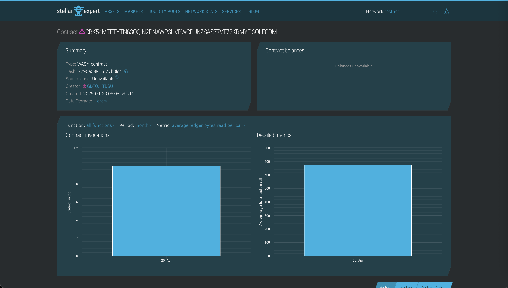

# Gate Pass Smart Contract 🚪

This is a smart contract built using **Rust** and **Soroban** (Stellar).  
It is used for managing a **Gate Pass system**.

## 📌 Features

- Add a new gate pass
- Get details of a gate pass
- Check if a gate pass exists

## 📁 Project Files

- `lib.rs` – Main contract logic  
- `test.rs` – Test cases for contract  
- `Cargo.toml` – Project configuration  

## 🛠️ Requirements

- Rust installed  
- Soroban CLI  

## ▶️ How to Run Tests

## Contract Details
CBK54MTETYTN63QQIN2PNAWP3UVPWCPUKZSAS77VT72KRMYFISQLECDM

